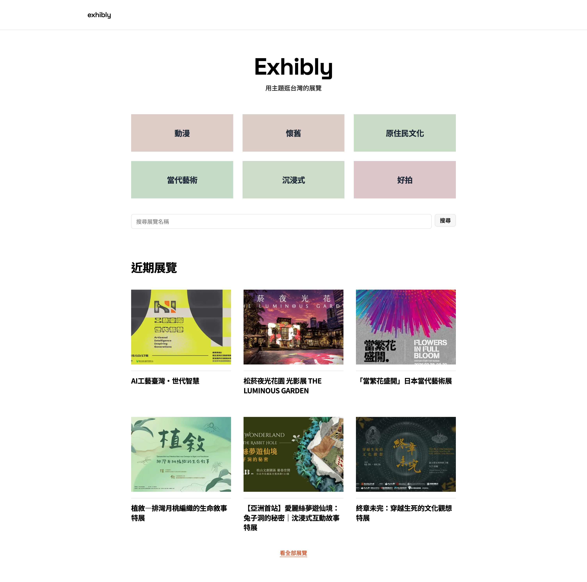
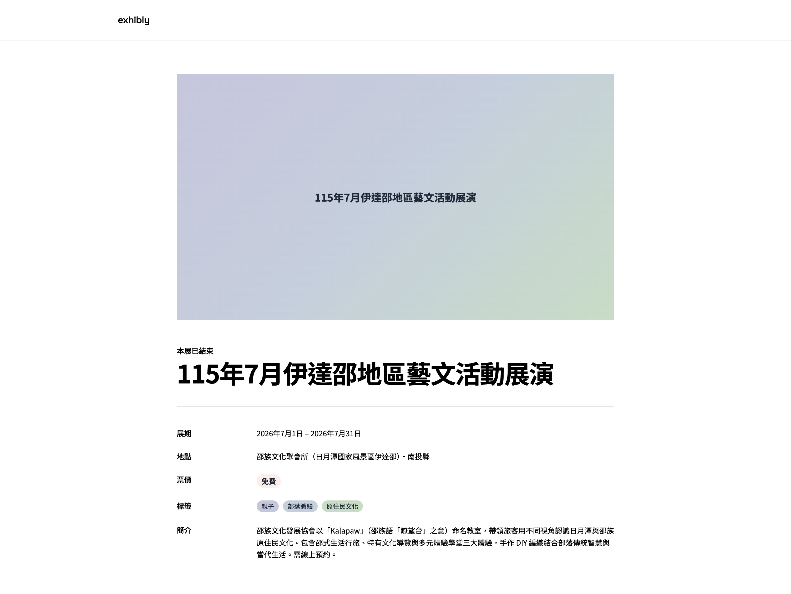
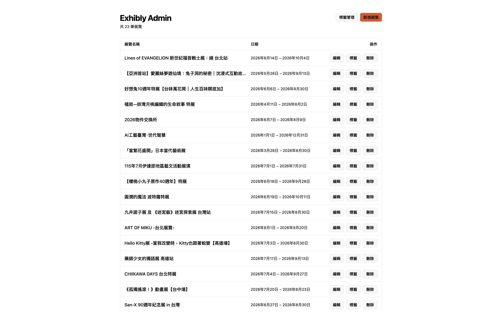
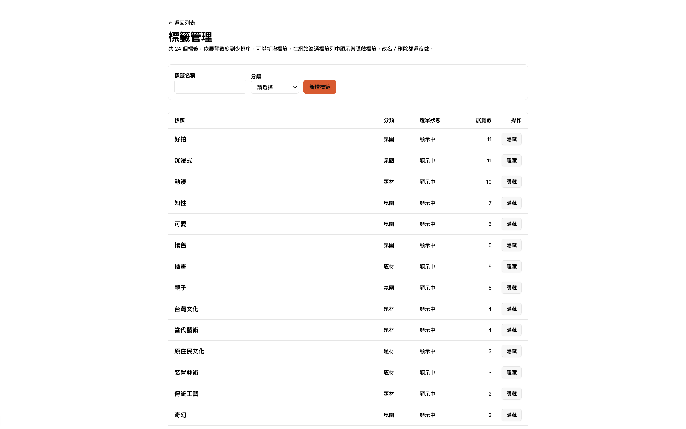

# Exhibly 台灣展覽平台

以主題標籤搜尋台灣各地展覽的平台。使用者可從「題材」與「氛圍」兩種主題入口切入，篩選出感興趣的展覽並查看詳情。

🔗 **Demo**：https://exhibly-web.vercel.app

展覽資訊散落在各官方網站與售票平台，而這些地方多半只能依地區或日期查找。

但我臨時想看展時，腦中浮現的通常是「最近想看點療癒的東西」或「想找科技藝術類的展」，所以我才動手創造了 Exhibly 台灣展覽平台。





## 功能

- 首頁精選主題入口，依題材(插畫、科技藝術…)與氛圍(療癒、懷舊…)分類
- 依主題標籤篩選展覽列表，可複選、可退選，篩選狀態反映在網址上
- 依展期狀態切換：現正展出 / 即將開展 / 已結束
- 依展覽名稱搜尋
- 展覽詳情頁：展期、地點、票價、官方網站與主題標籤

## 技術棧

- **Monorepo**：Turborepo + pnpm
- **前端**：Next.js（App Router）、React、Tailwind CSS v4、shadcn/ui
- **資料層**：Prisma 7（driver adapter 架構）
- **資料庫**：開發環境 Docker PostgreSQL / 正式環境 Supabase PostgreSQL
- **部署**：Vercel

## 技術決策

### 網址正規化：從「補上 https：//」改為白名單

後台可以填展覽的官方網址，詳情頁會把這個值直接放進 `<a href>`。最初的寫法很直覺：沒有 `http(s)://` 開頭就補上 `https://`。

後來回頭檢查才發現，`javascript:alert(1)` 會被補成 `https://javascript：alert(1)`——看起來擋住了，但那是巧合：補完之後它剛好不再是合法的 `javascript:` URL。防禦不能建立在巧合上，換一種已經帶 `://` 的變形就可能繞過去。

於是改成白名單：只明確處理認得的兩種情況——已經是 `http(s)://` 就放行，完全沒有 scheme 的裸網域才補 `https://`;偵測到任何其他 scheme(`javascript:`、`data:`、`file:`…)一律存 `null`，不嘗試修好它s。**黑名單要窮舉所有危險輸入，白名單只要窮舉安全輸入**，而後者是有限的。

這段驗證放在 server action 而不是只靠 `<input type="url">`：瀏覽器端的檢查繞過表單直接送 request 就不存在了。

### isListed：同一個欄位，三種讀取路徑

標籤累積到一定數量後，篩選頁的選單會變得雜亂——有些標籤只掛著一兩檔展覽，放進選單只是噪音。直覺解法是加一個「隱藏」開關。但「隱藏」到底隱藏了什麼?釐清之後，同一個 `isListed` 在三個讀取路徑上有三種待遇：

- **篩選頁選單**(`getListedTags`)：只撈 `isListed： true`。這是開關唯一該生效的地方。
- **展覽查詢**(`getExhibitions`)：完全不套用。`?tags=X` 這種直達連結，不管 X 有沒有上架都要篩得出來，否則使用者先前存下的分享連結會突然失效。
- **後台標籤管理**(`getTagsWithExhibitionCount`)：也不套用。管理頁必須看得到全部標籤，不然一個標籤被關掉之後，選單挑不到、管理頁也列不出來，就再也開不回來。

第三條是實作到一半才發現的：如果順手在每個查詢都加上 `where： { isListed： true }`，做出來的會是一個沒有回頭路的開關。

命名也因此換過一次。原本叫 `isVisible`，但那個字暗示「這個標籤到處都看不見」——實際上它貼在展覽上仍然生效、詳情頁的 Badge 照常顯示、直達連結照常篩得到，只是選單挑不到而已。**一個布林欄位的語意不在 schema 裡，而在所有讀取它的地方；命名要描述的是那個交集，不是最直覺的那一種用途。**

### 資料庫三次轉向

**SQLite(本地檔案)** → **Supabase(dev 與 prod 共用同一個雲端庫)** → **開發用 Docker PostgreSQL，正式用 Supabase**

起手選 SQLite 是刻意的：那個階段的目標只是打通「schema → migration → seed → 頁面讀得到資料」這條管線，雲端連線設定屬於維運知識，不該和資料建模的學習混在一起。

第二段搬上 Supabase，但 dev 和 prod 指向同一個資料庫。這在只有自己一個人開發時完全跑得動，問題是它把「試錯」和「線上資料」放在同一個地方——本地跑一次 `migrate dev`、seed 一次，動到的就是履歷連結上那個網站的資料。**這不是效能問題，是沒有安全的犯錯空間。**

第三段因此把開發庫拉回本地，用 Docker 跑 PostgreSQL。選 Docker 而不是退回 SQLite，是因為要的是「本地」而不是「輕量」：開發庫和正式庫必須是同一種資料庫，否則本地測得過不代表線上會過。

代價也很明確：多了一道 `migrate deploy` 的手續。本地的 `migrate dev` 和正式庫是兩條獨立的軌道，schema 改動在本地通過，不代表線上那張表真的有那個欄位——這個坑實際上踩過一次。

三次轉向裡，應用程式碼幾乎沒有改動，因為查詢都經過 Prisma。但「幾乎」不是「完全」：SQLite 不支援 enum，`Tag.category` 只能先存字串;換到 PostgreSQL 之後這個限制消失了，欄位型別卻還留在原地，是筆待還的技術債。**ORM 的抽象讓底層更換的成本變低，但抽象不會替你把當初為了遷就限制而做的妥協收回來。**

## 後台管理介面

`apps/admin` 是這個專案的內容管理後台，展覽資料都從這裡建立與維護。

- 展覽的新增、編輯、刪除，欄位驗證在 server action 完成
- 為展覽貼標籤(以單一交易全刪重建關聯，避免中途失敗留下沒有標籤的展覽)
- 標籤管理：新增標籤、切換是否出現在篩選選單、依展覽數排序





後台目前只在本機執行，尚未部署——登入與權限保護完成後才會上線。

## 本地開發

```bash
pnpm install

# 啟動本地 PostgreSQL
docker compose up -d

# 建立 schema 並塞入範例資料
pnpm --filter @exhibly/db exec prisma migrate dev
pnpm --filter @exhibly/db exec prisma db seed

pnpm dev
```

環境變數請複製 `packages/db/.env.example` 後填入，資料庫相關設定請參考 `packages/db`。
